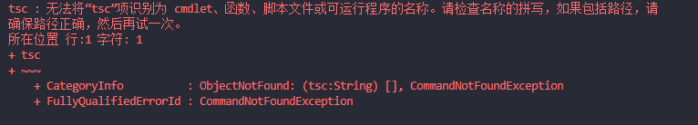
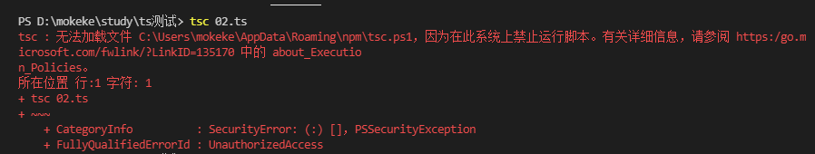

### 学习过程中遇见的问题总结
---
- 🔴 问题：tsc : 无法将“tsc”项识别为 cmdlet、函数、脚本文件或可运行程序的名称。请检查名称的拼写，如果包括路径，请
确保路径正确，然后再试一次。<br/>
如下图：

- 原因：我最近刚重新装机，忘记了电脑没有安装 typescript 的包。导致 tsc 命令无效。查询网络上，还有一种情况，就是没有全局安装 ts 的包，也会导致终端，无法识别 tsc 命令。
- 解决办法：
  - 全局安装 typescript 
  ```node
  npm i typescript -g
  ```
  - 使用node 提供的npx
  ```
  npx tsc xxx
  ```
----
- 🔴 问题：tsc : 无法加载文件 C:\Users\user_data\AppData\Roaming\npm\tsc.ps1，因为在此系统上禁止运行脚本。

- 解决办法
  - 在底部工具栏 搜索 windowsPowerShell（注意：一定要使这个，命令提示符不好使）
  - 利用管理员身份运行
  - 输入命令 set-ExecutionPolicy RemoteSigned

  - 输入 Y 即可。

----